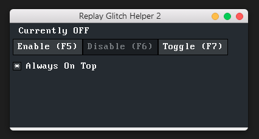
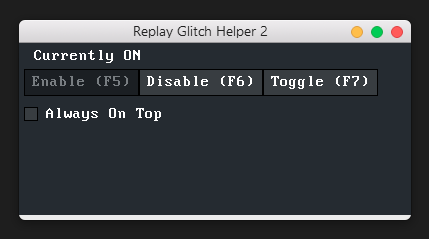

# Replay Glitch Helper 2
## Lightweight and portable connection control.

Replay Glitch Helper allows its users to seamlessly disable all networking traffic on their computer in an instant manner by pressing a corresponding key.
Although it is specifically designed to aid performing GTA:Online's Heist Replay Glitch, it can be used under any other circumstances.
Inputs are captured globally, thus Replay Glitch Helper 2 will function without being foregrounded.  

---

## Screenshots
**DO NOTE: The Macintosh appearance presented by the following images is a theme I use on my personal machine. Replay Glitch Helper 2 is Windows software.** \

---

## Compiling
Replay Glitch Helper 2 is designed to compile under mingw-w64 v11.0+. Some slight modifications might allow it to compile under other compilers or lower mingw-w64 major versions but support for such compilation environments won't be provided.

In case you experience any problems using your own compilation environment, here's my exact setup :
- mingw-w64 x64 v12.0.0 (GCC v14.2.0) without LLVM/Clang/LLD/LLDB (provided by [WinLibs.com](https://winlibs.com/#download-release))
- CMake v3.29.6 (bundled with CLion)
